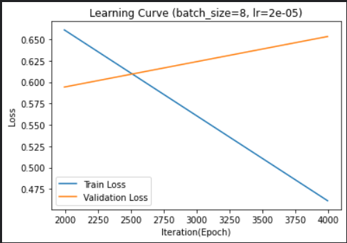
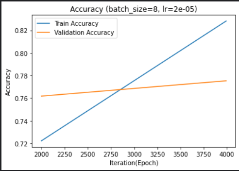
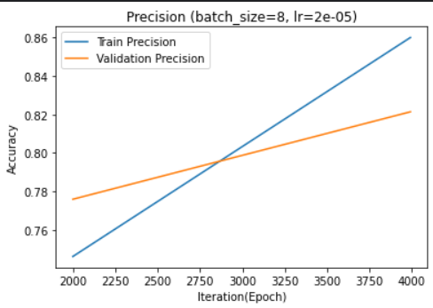
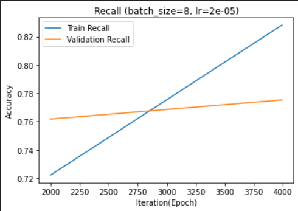
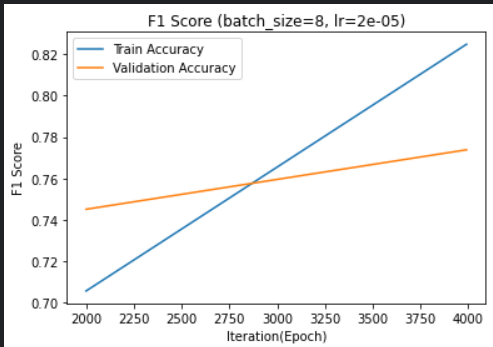
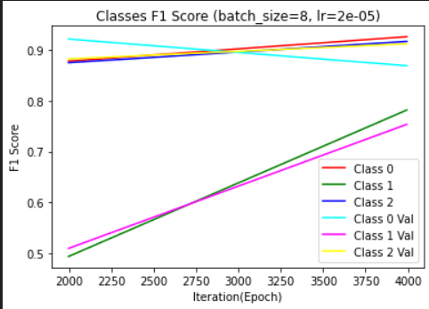

# Iliopoulos Nikolaos - 1115201800332

## AI 2 Exersice 4 - Tranformers

## Table of Contents

1. [Specifications](#specifications)

2. [Part 1](#section2)

   2.1 [Fine-tuning the BERT-base model](#section2.1)

   2.1 [Scores & Times](#section2.2)

3. [Part 2](#section3)

   3.1 [Process the SQUAD2 Dataset](#section3.1)

   3.1 [Fine-tuning the DistilBERT-base model](#section3.2)

   3.1 [Scores & Times](#section3.3)

4. [Part 3](#section4)

   4.1 [Fine-Tuning on SQUAD2](#section4.1)

   4.1 [Fine-Tuning on TriviaQA](#section4.2)

---

## Specifications <a name="specifications"></a>

I ran all the notebooks in the **Kaggle** platform.

- RAM: **13GB**
- GPU: **Tesla P100-PCIE-16GB**

---

## Part1 <a name="section2"></a>

Used:

- **bert-base-uncased**
- **AutoTokenizer**
- **BertForSequenceClassification**
- **AdamW**
- **tqdm** (progress bar for the loops in order to see the time)

Hyperparameters:

- Learning Rate: **2e-5**
- Batch Size: **4, 8**
- Epochs: **2**
- Max Sequence Length: **512**

#### Fine-tuning the BERT-base model <a name="section2.1"></a>

I tried to keep the max sequence length 512 (Bert's max), in order to have the maximum information in the input. So I used a small batch size of 4 or 8, otherwise it would ran out of memory.

I used the **BertForSequenceClassification** model, which is a pretrained BERT model, and I fine-tuned it with the **AdamW** optimizer.

```python
AdamW(self.model.parameters(), lr=2e-5, eps=1e-8)
```

I **clipped the gradients** to prevent exploding gradients.

```python
torch.nn.utils.clip_grad_norm_(self.model.parameters(), 1.0)
```

I used the **encode_plus()** function from the **AutoTokenizer** library, which is a pre-trained BERT tokenizer.

```python
tokenizer.encode_plus(tweet,
                      add_special_tokens = True,
                      max_length = 512,
                      pad_to_max_length = True,
                      return_attention_mask = True,
                      return_tensors = 'pt')
```

#### Scores & Times <a name="section2.2"></a>

Time for 1 epoch on the training set: **~ 15min**
Time for 1 epoch on the validation set: **~ 43sec**
F1 Score in the validation Squad2 dataset **~ 0.77**

<p align="center">
    
    
    
</p>

<p align="center">
    
    
    
</p>

---

## Part2 <a name="section3"></a>

Used:

- **distilbert-base-uncased**
- **AutoTokenizer**
- **DistilBertForQuestionAnswering**
- **AdamW**
- **tqdm** (progress bar for the loops in order to see the time)

Hyperparemeters:

- Learning Rate: **2e-5**
- Batch Size: **8, 16**
- Epochs: **2**
- Max Sequence Length: **512**

#### Process the SQUAD2 Dataset <a name="section3.1"></a>

- Split the dataset to texts, questions and answers
- Find the answer end position (start position + lenght of the answer)
- Tokenize the texts and questions
- Update the answers with the start and end positions that coresponds to the tokenized format

#### Fine-tuning the DistilBERT-base model <a name="section3.2"></a>

I tried to keep the max sequence length 512 (Bert's max), in order to have the maximum information in the input. So I used a small batch size of 8 or 16, otherwise it would ran out of memory.

I used the **DistilBertForQuestionAnswering** model, which is a pretrained DistilBERT model, and I fine-tuned it with the **AdamW** optimizer.

```python
AdamW(self.model.parameters(), lr=2e-5, eps=1e-8)
```

I **clipped the gradients** to prevent exploding gradients.

```python
torch.nn.utils.clip_grad_norm_(self.model.parameters(), 1.0)
```

Tokenized with **Truncation** and **Padding to max length**.

```python
tokenizer(self.texts,
         self.queries,
         truncation=True,
         padding=True)
```

#### Scores & Times <a name="section3.3"></a>

Time for 1 epoch on the training set: **~ 40min**
Time for 1 epoch on the validation set: **~ 3min**
F1 Score in the validation Squad2 dataset **~ 0.68**

---

## Part3 <a name="section4"></a>

**I used the previous code of the Part 2 to train the model**

#### Convert TriviaQA to the SQUAD2 format

I copied all the necessery code to tranform the TriviaQA dataset to the SQUAD2 format and added them as cells in the notebook. ( [Utils](https://github.com/mandarjoshi90/triviaqa/tree/master/utils), [triviaqa_to_squad.py](https://github.com/amazon-research/qa-dataset-converter/blob/main/triviaqa/triviaqa_to_squad.py) )

After the convertion 2 files where created:

- **triviaqa_train.json**
- **triviaqa_dev.json**

#### Fine-Tuning on SQUAD2 <a name="section4.1"></a>

Time for 1 epoch on the training set: **~ 40min**

> - validation on SQUAD2
>   F1 Score in the validation SQUAD2 dataset **~ 0.68**

> - validation on TriviaQA
>   Just used the code from the Part 2 and changed the **data_Val = "triviaqa_dev.json"**.
>   So the model will be fine-tuned on Squad and tested on the TriviaQA dev dataset.
>   F1 Score in the validation TriviaQA dataset **~ 0.35**

#### Fine-Tuning on TriviaQA <a name="section4.2"></a>

Reduced data to 50.000 lines cause it ran out of memory.
Time for 1 epoch on the training set: **~ 22min**

> - validation on TriviaQA
>   F1 Score in the validation TriviaQA dataset **~ 0.45**

> - validation on SQUAD2
>   Lowered the batch sized to from **16 to 2**, cause it ran out of memory.
>   F1 Score in the validation SQUAD2 dataset **~ 24**
